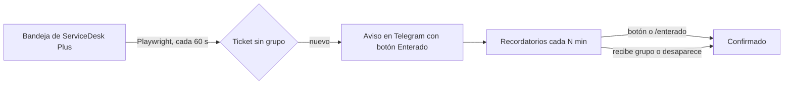

# Autum

Monitor de tickets sin asignar para **ManageEngine ServiceDesk Plus Cloud**. Cuando entra un ticket nuevo sin grupo, te avisa por **Telegram** y te lo **sigue recordando hasta que confirmes "Enterado"**, para que ninguno se pierda, ni siquiera de madrugada.

> Proyecto independiente, sin relación con ManageEngine, Zoho ni Telegram. Úsalo solo si tu organización permite este tipo de automatización sobre su mesa de ayuda.

## La idea

En una mesa de ayuda, un ticket sin grupo asignado es un ticket que nadie ha visto. Las notificaciones normales se pierden fácilmente: llegan una vez, se silencian o se entierran en el correo.

Autum resuelve eso con tres piezas:

1. **Detectar**: un navegador (Playwright) revisa la bandeja de solicitudes cada minuto, con tu propia sesión.
2. **Avisar**: si hay un ticket cuya columna *Group* es `-`, manda un mensaje a Telegram con un botón **✅ Enterado**.
3. **Insistir**: repite el aviso cada pocos minutos hasta que pulses el botón. Se detiene solo si el ticket recibe grupo o desaparece de la bandeja.



## Requisitos

- Node.js 18 o superior
- Una cuenta con acceso a la bandeja de solicitudes de ServiceDesk Plus Cloud
- Un bot de Telegram (créalo con [@BotFather](https://t.me/BotFather))
- Un equipo que se mantenga encendido y sin suspender mientras corre

## Instalación

```bash
git clone https://github.com/<tu-usuario>/autum.git
cd autum
npm install
npm run setup        # descarga el Chromium de Playwright
cp .env.example .env # en Windows PowerShell: Copy-Item .env.example .env
```

Edita `.env` con tus datos:

| Variable | Descripción |
|---|---|
| `SDP_BASE_URL` | URL de tu ServiceDesk Plus, sin barra final |
| `TELEGRAM_BOT_TOKEN` | Token que te da @BotFather |
| `TELEGRAM_CHAT_ID` | Tu chat ID numérico |
| `POLL_SECONDS` | (opcional) Cada cuánto revisar la bandeja. Por defecto 60 |
| `REMINDER_MINUTES` | (opcional) Cada cuánto repetir el recordatorio. Por defecto 2 |
| `HEADLESS` | (opcional) `false` por defecto. Ver [Notas](#notas-y-limitaciones) |

### Obtener tu chat ID

1. Escríbele cualquier mensaje a tu bot.
2. Abre `https://api.telegram.org/bot<TOKEN>/getUpdates` en el navegador.
3. Busca `"chat":{"id": 123456789, ...}`. Ese número es tu `TELEGRAM_CHAT_ID`.

## Uso

```bash
npm run test:telegram   # verifica que el token y el chat ID funcionen
npm run auth            # abre el navegador: inicia sesión a mano (una vez)
npm start               # arranca el monitor
```

La primera vez, Autum avisará de **todos** los tickets que ya estén sin grupo. Después solo avisa los nuevos.

### Comandos de Telegram

| Acción | Efecto |
|---|---|
| Botón **✅ Enterado** | Confirma ese ticket y detiene sus recordatorios |
| `/enterado` | Confirma todos los pendientes |
| `/pendientes` | Lista los tickets pendientes de confirmar |

Solo se atienden mensajes y botones del chat configurado en `TELEGRAM_CHAT_ID`.

### Si la sesión expira

Autum te avisa por Telegram, cierra el navegador y **sigue recordándote los pendientes**. Ejecuta `npm run auth` en otra terminal y el monitor se reanuda solo al detectar la sesión nueva.

### Arrancar con Windows

En el Programador de tareas crea una tarea con el desencadenador **"Al iniciar sesión"** que ejecute `npm start` en la carpeta del proyecto. Debe correr con tu usuario con sesión iniciada, porque el navegador necesita escritorio.

## Estructura

```
autum/
├── src/
│   ├── config.js          # Carga el .env, rutas y constantes
│   ├── browser.js         # Navegador Playwright y sesión guardada
│   ├── auth.js            # Inicio de sesión manual y captura de sesión
│   ├── monitor.js         # Bucle principal, recordatorios y Telegram
│   ├── notify.js          # Cliente de la Bot API de Telegram
│   └── test-telegram.js   # Mensaje de prueba
├── data/                  # (se crea solo, ignorado por Git)
│   ├── perfil/            #   perfil del navegador
│   ├── auth.json          #   cookies de la sesión
│   └── state.json         #   tickets vistos y pendientes
├── .env.example
├── .gitignore
├── LICENSE
├── package.json
└── README.md
```

## Cómo funciona por dentro

- **Sesión:** `npm run auth` guarda la sesión de dos formas: en un perfil persistente de Chromium (`data/perfil/`) y en `data/auth.json`. Las cookies de sesión sin fecha de expiración no sobreviven al cerrar el perfil, por eso se reinyectan desde `auth.json` al arrancar.
- **Lectura de la tabla:** se leen solo las filas más internas de la tabla, se detecta la columna *ID* por su contenido (números de 5 a 7 dígitos) y se toma como *Group* la columna siguiente.
- **Tres bucles en paralelo:** revisión de la bandeja (cada `POLL_SECONDS`), recordatorios (cada 15 s comprueba cuáles vencieron) y escucha de Telegram por long polling (los botones responden casi al instante).
- **Estado:** `data/state.json` guarda tickets vistos y pendientes, así que un reinicio no pierde recordatorios.

## Seguridad

- `.env` y `data/` contienen secretos y una sesión que equivale a entrar como tú **sin contraseña ni MFA**. Están en `.gitignore`; no los subas ni los compartas.
- Si el token del bot se filtra, revócalo con `/revoke` en @BotFather.
- Si sospechas que se filtró la sesión, ciérrala desde la configuración de tu cuenta de Zoho.

## Notas y limitaciones

- **Modo con ventana:** Zoho suele rechazar la sesión en navegador headless. Por eso Autum abre una ventana real, pero la coloca fuera del área visible de la pantalla. No la cierres.
- **Solo una instancia a la vez:** Telegram permite un solo consumidor de `getUpdates`. Dos monitores darán error `409`. Si el bot tiene un webhook configurado, quítalo con `deleteWebhook`.
- **No correr `auth` y el monitor a la vez** sin necesidad: comparten el perfil del navegador (con el monitor en estado "sesión expirada" sí es seguro).
- **Es scraping de la interfaz:** si ManageEngine cambia el diseño de la tabla, puede requerir ajustes.
- **Si el equipo se apaga o se suspende,** no hay avisos. Los pendientes se conservan y se retoman al volver a iniciar.
- Un ticket que llegue y se asigne en menos de un intervalo de revisión no se detecta.

## Ideas a futuro

- Usar la API v3 con OAuth de ServiceDesk Plus en lugar de scraping (más estable, requiere autorización del administrador)
- Tope de recordatorios u horarios silenciosos
- Escalamiento a llamada telefónica si nadie confirma
- Ejecutarlo como servicio de Windows

## Licencia

[MIT](LICENSE)
